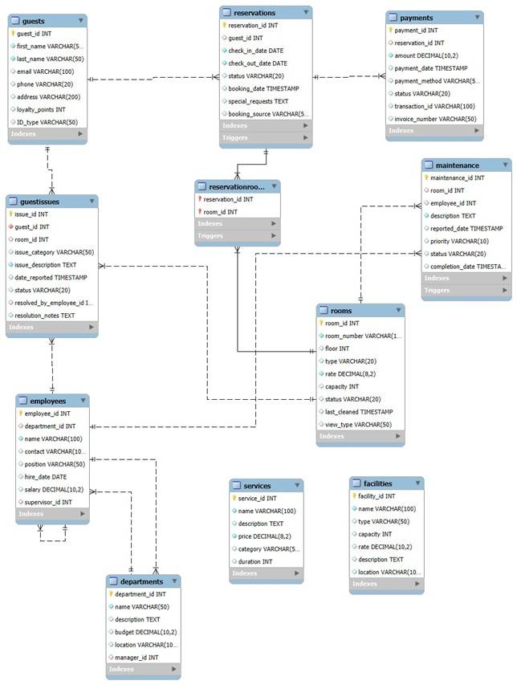

# Hotel Dost – Hotel Booking Management System

A database-driven hotel booking management system built using **PHP, MySQL, HTML, CSS, and JavaScript**.

The system allows users to reserve rooms, manage guest details, and process bookings through a structured database workflow.

---

## Tech Stack

Frontend
- HTML
- CSS
- JavaScript

Backend
- PHP (PDO)

Database
- MySQL

Tools
- VS Code
- XAMPP
- MySQL Workbench

---

## Features

- Guest registration and management
- Room reservation system
- Payment processing
- CRUD operations for bookings
- Relational database design
- Many-to-many relationship handling

---

## Database Design

Tables used in the system:

- Guests
- Reservations
- Rooms
- ReservationRooms
- Payments

---

## Project Structure
hotel-dost-dbms
├── config
│ └── db_connect.php

├── database
│ ├── schema.sql
│ ├── triggers.sql
│ └── sample_data.sql

├── public
│ ├── home.php
│ ├── book.php
│ └── submit_booking.php

---

## How to Run the Project

1. Install XAMPP
2. Start Apache and MySQL
3. Import the database schema from:
    database/schema.sql
4. Place the project inside the `htdocs` folder
5. Open in browser:
   http://localhost/hotel-dost-dbms/public/home.php
   
---
## Application Preview

### Home Page

### Booking Form

### Booking Confirmation

### About Page

### Contact Page

## Database ER Diagram

## Project Demo Flow

1. User visits the Home Page of the hotel booking system.
2. User navigates to the Booking Form.
3. User enters guest and reservation details.
4. The backend processes the request using PHP and PDO.
5. Data is stored in the MySQL database (Guests, Reservations, Payments).
6. A booking confirmation message is displayed to the user.

## Author

Vismaya Hiremath  
B.Tech CSE (Hons.), RV University